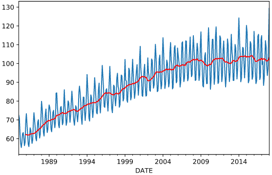

 

# Data Science Séries Temporais

Séries temporais em data science são conjuntos de dados que representam a evolução de uma variável ao longo do tempo. Esses dados são coletados em intervalos regulares (por exemplo, diariamente, semanalmente, mensalmente) e cada observação é registrada com uma marca de tempo.

As séries temporais são comumente usadas em diversas áreas, como finanças, economia, ciências sociais, climatologia, entre outras, para analisar e prever comportamentos e tendências ao longo do tempo.

A análise de séries temporais envolve a aplicação de técnicas estatísticas e matemáticas para identificar padrões, detectar sazonalidades, avaliar a presença de tendências e fazer previsões futuras com base em dados históricos.

  

# Séries Temporais - Prophet

  

Prophet é uma biblioteca de previsão de séries temporais desenvolvida pelo Facebook. Ele permite aos usuários modelar tendências sazonais e de longo prazo, bem como eventos e feriados específicos que podem afetar as séries temporais.

O Prophet é bastante robusto, simples e fácil de usar. É possível encontrar na internet exemplos de código utilizando o Prophet sem nem se preoucupar se a Série Temporal é estacionária. Em alguns casos o resultado é bom, mas nem sempre.

# Projetos

Apresentamos neste portfólio 3 projetos que abordam algumas técnicas de análise de times series, forecasting e prophet:

* **[Séries temporais (Time Series)](https://github.com/joaomarcelofc/Data_Science_Time_Series/blob/main/S%C3%A9ries_Temporais_(Time_Series)_JM.ipynb)**

* **[Time Series e Prophet](https://github.com/joaomarcelofc/Data_Science_Time_Series/blob/main/Times_Series_Prophet_JM.ipynb)**

* **[Forecasting com Time Series](https://github.com/joaomarcelofc/Data_Science_Time_Series/blob/main/Forecasting_Series_Temporais_Prophet_JM.ipynb)**

